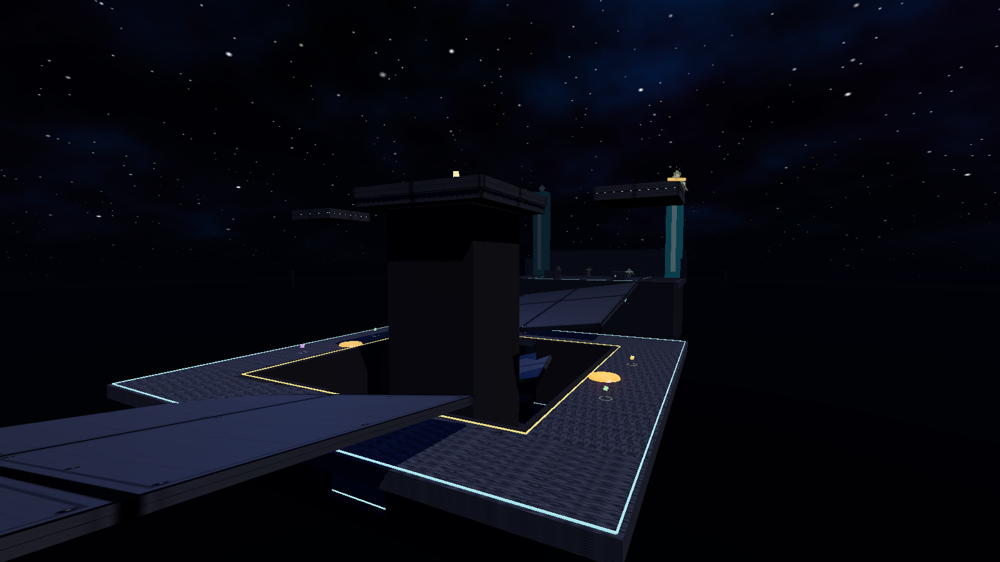
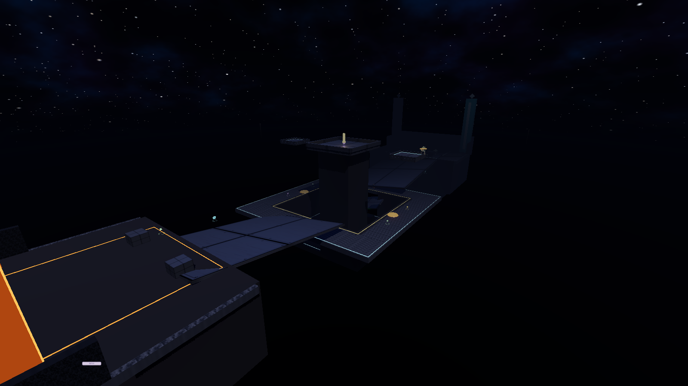
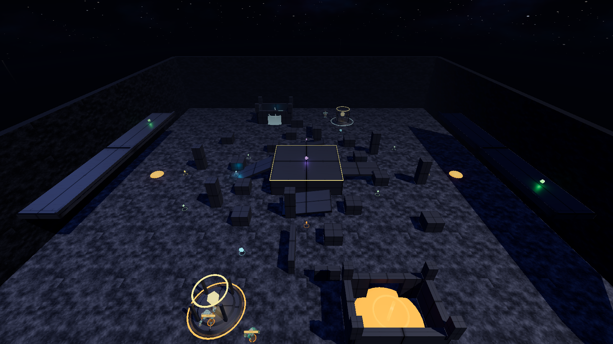
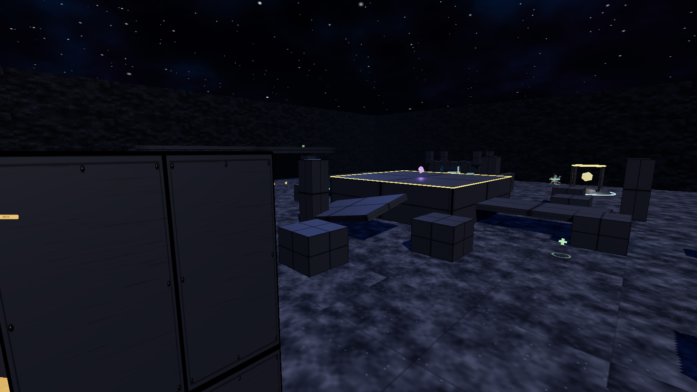
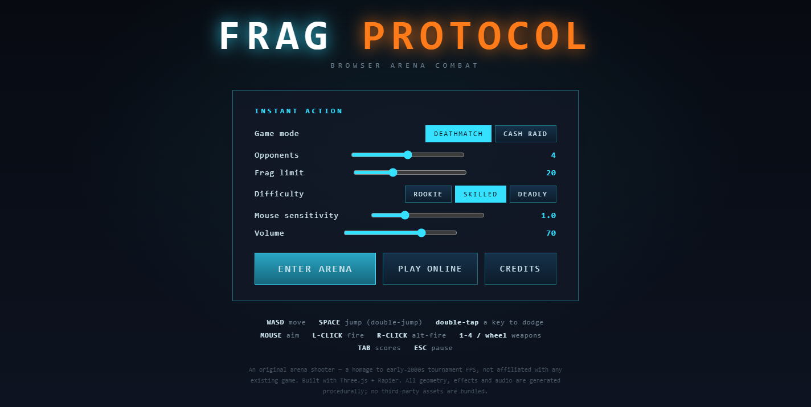
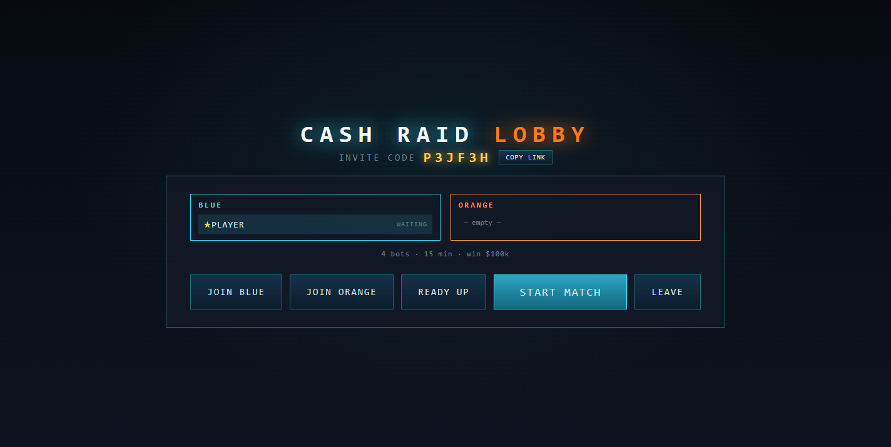

# FRAG PROTOCOL

A browser-based **arena first-person shooter** — a homage to early-2000s
tournament FPS (Unreal Tournament 2003 and friends), running entirely in the
browser with no plugins and no install. Two modes — classic **Deathmatch**
and the team-based **Cash Raid** — playable solo vs. AI bots **or** in online
multiplayer rooms with a pre-match lobby and shareable invite codes.

> **What this is.** An *original* game inspired by the UT2003 *experience* —
> fast dodge/double-jump movement, arena deathmatch, shock/rocket/flak weapon
> archetypes, an announcer, AI bots. It is **not** Unreal Tournament 2003 and
> ships none of that game's code, engine or assets — those are Epic Games'
> property. Like the "play Counter-Strike in your browser" sites, this is a
> *recreation* of the genre, not the original game. Names are original.

Built with **Three.js** (WebGL + bloom), **Rapier** (WASM physics),
TypeScript and Vite. Online play uses a small authoritative **Node + ws**
server.

## Try it now

**[jaykumarthaker.github.io/frag-protocol-fps](https://jaykumarthaker.github.io/frag-protocol-fps/)**

No install, no plugin — runs entirely in the browser. Click the canvas to
lock the mouse and start playing. For online multiplayer, **Play Online →
Create Room** — the server URL is pre-filled automatically.

## Screenshots

|  |  |
|:-:|:-:|
| <br>**Deathmatch — The Atrium** — a multi-tier sky citadel | <br>**Stacked tiers** — mountain bases, causeways, a sunken valley |
| <br>**Cash Raid** — raid vaults, bank the cash | <br>**Vaults & buy stations** — spend banked money mid-match |
| <br>**Main menu** — Deathmatch or Cash Raid | <br>**Online lobby** — invite-code rooms & team select |

## Play it

```bash
npm install
npm run dev
```

Open the printed URL (default <http://localhost:5173>). From the menu:

- **Instant Action** — pick **Deathmatch** or **Cash Raid** and play offline
  vs. AI bots.
- **Play Online** — create or join a room for live multiplayer (see below).

Click the canvas to lock the mouse.

### Controls

| Action            | Input                                   |
|-------------------|-----------------------------------------|
| Move              | `W` `A` `S` `D`                         |
| Jump / double-jump| `Space` (tap twice in the air)          |
| Dodge             | double-tap a movement key               |
| Aim               | Mouse                                   |
| Fire / alt-fire   | Left click / Right click                |
| Switch weapon     | `1`–`4`, mouse wheel, or `Q`            |
| Interact (Cash Raid)| hold `E` — deposit at / raid a vault  |
| Buy menu (Cash Raid)| `B` near your buy station; `1`–`5` to buy |
| Scoreboard        | hold `Tab`                              |
| Pause             | `Esc`                                   |

### Weapons

| Slot | Weapon          | Primary                         | Alt-fire                       |
|------|-----------------|---------------------------------|--------------------------------|
| 1    | Railgun         | instant-hit sniper, 2× headshots| —                              |
| 2    | Shard Cannon    | 9-pellet flak spread            | heavy explosive chunk          |
| 3    | Rocket Launcher | splash rocket (rocket-jump!)    | —                              |
| 4    | Pulse Rifle     | rapid beam                      | plasma orb — **beam an orb for the combo blast** |

### Game modes

**Deathmatch** — classic free-for-all: first to the frag limit, or the most
frags when the clock runs out, wins.

**Cash Raid** — two teams on a purpose-built two-base map. Raid the enemy
vault for cash, carry it home, and **hold `E`** in your own vault to bank it.
Die while carrying and you drop 70% of it as a briefcase anyone can grab. Bank
money is the team's shared wallet — spend it at your **buy station** (`B`) on
weapons and armour. First team to the win target, or the richer bank at time,
wins. Bots play the objective: they raid, carry, bank and defend.

## Multiplayer

Online play runs against a small authoritative server that hosts many
independent **rooms**, each with its own pre-match lobby.

```bash
cd server
npm install
npm start            # ws://localhost:2567  (set PORT to change)
```

Then in the game choose **Play Online**:

- **Create Room** — pick the mode and settings (max players, duration, bots,
  win target, public/private). You get a 6-character **invite code** and a
  shareable link (`?room=CODE`).
- **Join Room** — enter a code, or open an invite link to jump straight in.
- In the **lobby**, pick a team, ready up, and the host starts the match.

How it works:

- Clients simulate their own player locally (responsive) and report
  transforms ~20 Hz; remote players are interpolated between snapshots.
- The server is **authoritative** for health, kills, scores, the match clock
  and **all Cash Raid money** (carried cash, team banks, vault deposits,
  death drops, purchases), so every client agrees on the outcome.
- Rooms can be filled with objective-aware bots via the lobby's bot count.

See [server/README.md](server/README.md) for hosting notes.

## Build & deploy

```bash
npm run build      # type-checks, then bundles to dist/
npm run preview    # serve the production build locally
```

`dist/` is a static site — host it anywhere (Netlify, Vercel, GitHub Pages,
itch.io). `vite.config.ts` uses `base: './'` so it works from any sub-path.
Two CI/CD workflows are included:

- **[`.github/workflows/deploy.yml`](.github/workflows/deploy.yml)** — builds
  and publishes the static frontend to **GitHub Pages** on every push to
  `main`. Enable Pages under *Settings → Pages → Source: GitHub Actions*.
  Set the `VITE_WS_URL` repository secret to your server's `wss://` address
  and the client will have it pre-filled for players.

- **[`.github/workflows/railway-deploy.yml`](.github/workflows/railway-deploy.yml)**
  — deploys `server/` to **Railway** on every push to `main`. Requires two
  repository secrets: `RAILWAY_TOKEN` (Account Settings → Tokens) and
  `RAILWAY_SERVICE_ID` (service Settings page in Railway dashboard).

## Project structure

```
src/
  core/      Game orchestrator, input, look math, model loading, types
  physics/   Rapier world + character controller wrapper
  arena/     blockout deathmatch arena + two-base Cash Raid arena
  entities/  Actor/Player/Bot/RemotePlayer, Projectile, Pickup,
             VaultZone, BuyStation, CashDrop
  weapons/   weapon data + firing system (hitscan / pellets / projectiles)
  ai/        BotBrain (perception, A* nav, combat, Cash Raid objectives)
  audio/     procedural Web Audio SFX + speech-synthesis announcer
  effects/   transient visual FX (tracers, beams, explosions)
  net/       online protocol + WebSocket client
  ui/        HUD overlay, menus + lobby screens, buy menu
  game/      Match (deathmatch) + CashRaidRules, teams, shop
server/      authoritative server: rooms, lobby, server bots (Node + ws)
```

## Assets

The only bundled third-party asset is a **CC0 (public-domain) character
model** (`RobotExpressive`); every other mesh, texture and sound is generated
procedurally at runtime. See [ASSETS.md](ASSETS.md) for the full log and
licensing.

## Status & roadmap

Done: arena movement, 4 weapons, AI bots, deathmatch, HUD/menus, procedural
audio + announcer, an art pass (animated characters, bloom, environment),
online multiplayer, and the team-based **Cash Raid** mode — teams, vaults,
carried money, death drops, buy stations, a purpose-built two-base map,
objective-aware bots, and a server-authoritative rooms + lobby system with
invite codes.

Possible next steps: client-side prediction for lower-latency online play, the
Cash Raid "Most Wanted" / minimap layer, defensive upgrades (turrets, traps),
player classes, ranked matchmaking, and a proper environment-art pass with CC0
modular kits.

## Credits

Engine libraries: [Three.js](https://threejs.org) (MIT),
[Rapier](https://rapier.rs) (Apache-2.0), [ws](https://github.com/websockets/ws)
(MIT). Character model "RobotExpressive" by Tomás Laulhé / Don McCurdy (CC0).
Everything else is original. Not affiliated with Epic Games.
